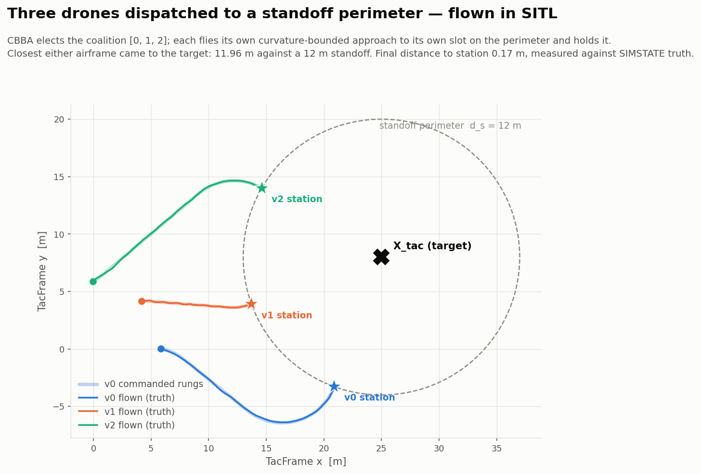

# hive_assist — anchor-referenced cooperative swarm

**From a coordinate in hand to gated setpoints.** An external detector says
*"the thing is at (lat, lon)"*. Everything from there on is this directory:
establish a metric frame off a surveyed anchor, hold an anchored loiter mesh,
elect a sub-team by auction, and dispatch one agent to a standoff station near
the target — with every emitted setpoint pre-validated against the same
invariants the Rust supervisor enforces.

Builds on [`../brain/`](../brain/) — the iSAM2 estimator, the `swarm-supervisor`
crate, the MAVLink path. Reuse first, extend second.

> Target *detection* is explicitly not our domain. Our input contract is one
> message `{lat, lon, alt?, task_id}`; our output contract is per-tick,
> per-vehicle `SET_POSITION_TARGET_LOCAL_NED`, already gated.

Plan and full derivations: [ANCHOR_SWARM_PLAN.md](ANCHOR_SWARM_PLAN.md).
Run instructions: [RUN.md](RUN.md). **261 tests, all passing.**

> **Restructured 2026-08-08 — the vision front end is deleted, not deferred.**
> The estimator core was always range + anchor + a constant-velocity prior; the
> VIO/IMU/RGB-D path was a second stack layered on top and the sole reason
> anything needed a GPU. Removing it removes every red row of the old forensic
> log — the 14.9 m in-flight lie at 10 cm σ, the 7 m of reported motion on a
> stationary airframe, the Gazebo EGL segfault, the RTF ceiling — because those
> were all vision/render faults. IMU, attitude and gravity are now fused by the
> autopilot's own EKF3, which already does that job well. What remains is
> geometry, and it runs on an 8 GB M1 with room to spare.

---

## The result in one figure each

### Domain 1 — a surveyed anchor makes the estimator full-rank


The plan claimed a single anchor collapses the SE(2) gauge from 3 to 0. Measured,
it does not — **not with ranges alone**. Rotate the whole solution about the
anchor and every anchor range, every inter-agent range and every body-frame
odometry residual is preserved. The symmetry is exact, so `dim ker(H) = 1`
survives however long the swarm flies.

| | |
|---|---|
| no anchor | `dim ker(H) = 3` |
| 1 anchor, range only | `1` — rotation about the anchor, alignment 1.000000000 |
| + bearing in the **vehicle's** frame | `1` — buys nothing |
| + bearing in the **anchor's surveyed** frame | **`0`** |
| 2 surveyed anchors, range only | **`0`** |

In metres: range-only pins the swarm centroid **radially to 2.7 cm** and leaves
it **tangentially free at 2006 m**. You know how far away you are, not which way
round. So the plan's open question has a definite answer — survey the anchor's
*heading*, or survey a *second* anchor. The motion-baseline route does not exist.

### Domain 1 — and it stays attached to the world


The contrast the plan is really about. A reference *drone* removes the
singularity (a convention); a surveyed *anchor* removes the drift (external
information). Both runs are full rank at every keyframe. The pinned one ends
**1.16 m from truth while reporting σ = 0.26 m** — it does not merely drift, it
stops knowing that it is drifting, and that reported σ is exactly what the
supervisor's covariance gate reads.

### Domain 2 — `M→N` handover with zero supervisor rejections

```
ANCHOR_INIT  -> LOITER_MESH   frame surveyed, mesh inside fence
LOITER_MESH  -> TASK_INGEST   target projected into TacFrame
TASK_INGEST  -> AUCTION       coalition [2, 3] elected in 3 rounds
AUCTION      -> RECONFIG      loiter re-solved over 10 agents
RECONFIG     -> DISPATCH      approach stream pre-validated

supervisor ACCEPT   80/80        guard failures    0
supervisor REJECT   0            min clearance     1.273 m (floor 1.2)
                                 max tick step     0.900 m (limit 0.9)
```

`ACCEPT` is the steady state by construction: each transition forward-simulates
its full setpoint stream over horizon `H` and only commits if the stream already
satisfies every invariant. A `REJECT` would be a caught bug, not an event.

### Domain 3 — dispatch converges to a station, never to the target


Edge-triggered on the go-signal, single agent, curvature-bounded Dubins path
sized from the vehicle's own `v/ω` limit. No impact-time consensus, no
simultaneity coupling, no terminal homing — the vehicle stops 12 m from `X_tac`
at the bearing the task asked for. Peak cross-track error 17 cm.

### Domain 4 — a range-only closed loop that actually flies (S0, measured)

One headless ArduCopter SITL, GPS off (`GPS_TYPE=0`), no camera, no renderer,
no ROS 2. The loop is real: estimator → EKF3 → attitude controller → motors →
true position → ranges → estimator. Only the UWB radio is simulated, exactly as
SITL already fakes a GPS.

```
mode 'square' — armed, climbed, flew all four 5 m legs, landed, disarmed

estimator error (mean)   0.026 m      reported sigma  0.017 m
ERROR / SIGMA            1.44         <- the acceptance bar is ~1
altitude held            1.86-2.34 m AGL over 549 ticks
waypoint legs completed  4 / 4

range-in -> extnav on the wire   p50  1.8 ms   p99  8.4 ms   (budget 25 ms)
plan -> gate -> setpoint         p50 11.2 ms   p99 17.6 ms
external-nav stream              3027 sends, worst gap 122 ms, CONTINUOUS

plans submitted 130   supervisor ACCEPT 130   REJECT 0   guard failures 0
```

The number that matters is **1.44**, not 0.026. The old stack was calibrated at
rest (ratio 0.78) and 147× overconfident the moment anything moved — 14.9 m of
error reported as 10 cm of confidence, which the supervisor's trust gate would
have certified. Error and sigma now agree *while flying*, which is the claim the
whole project exists to make.

RTF is retired as a metric: with no renderer it is 1.000 by construction and
there is no physics lockstep to measure it against. Loop latency and jitter
replace it.

### Domain 3, flown — the dispatch figure, now against live physics



The offline figure above is `follow()`'s own integrator: a perfect vehicle on a
perfect estimate. This is where two ArduCopter airframes actually went, on a
range-only GPS-denied estimate, with the CBBA auction electing the coalition
live for the first time.

```
AUCTION: coalition [0, 3] elected in 1 round, converged
v0 -> station (13.01, 8.52)   Dubins LSR 12.0 m
v3 -> station (16.15, -0.11)  Dubins RSL 18.5 m

closest either airframe came to the target   11.98 m   against a 12 m standoff
final distance to station                    0.20 m    vs SIMSTATE truth
81 plans, 81 ACCEPT, 0 REJECT, 0 guard failures
```

**11.98 m against a 12 m standoff** is the claim: the coalition converges to the
perimeter, never inside it — the same thing the offline figure asserts, now with
an airframe and an estimator that can be wrong.

Two things this cost, both of which the offline path had never exposed:

- **A start heading of `0.0` is not free.** `dispatch` hardcodes it, and over a
  hop shorter than `2R` an arbitrary heading forces Dubins into a loop — one
  that swung to **5.38 m** from the target, inside the perimeter the whole
  domain exists to respect. The endpoint was still correct, so nothing else
  would have caught it. The start heading is now the bearing to the station.
- **A target can be too close to be a standoff target at all.** With D3's own
  `(16, 3)`, vehicle 0 begins 10.4 m from it — already inside the 12 m circle.
  There is no path out of a circle you start within that never enters it, so
  `dispatch_coalition` refuses, in the same idiom `translate` refuses a goal
  outside the anchor footprint.

### Domain 4 — "freeze safely" needs a gate that does not exist yet


The half that already works: during an outage nothing is emitted and the vehicle
holds. **The lunge is in the recovery.** While the vehicle is frozen the planner
keeps advancing its stream, so the first plan to land is 7.2 m away — 8× a legal
tick — and it passes every gate the supervisor has, because *freshness bounds a
plan's age and nothing bounds its distance*.

Fixing it takes both halves. The gate alone is safe and stalls (9% mission
progress at 30% loss); re-planning alone still lunges. Together: 0.90 m worst
jump, 100% progress, at every loss level.

---

## Layout

```
hive/
  frames.py                D1.0  geodetic → TacFrame (the one geodesy boundary)
  anchor_factor.py         D1.1  residuals, analytic Jacobians, gauge generators
  nullspace.py             D1.2  the rank ladder
  anchored_isam2.py        D1.3  GTSAM/iSAM2, anchored vs pinned
  cbba.py                  D2.1  coverage-aware bids, election, graph cut
  supervisor_gate.py       D2.2  Python mirror of the Rust invariants + horizon guard
  mission_fsm.py           D2.3  the guarded FSM
  standoff.py              D3    stations, Dubins, vector-field follower + capture
  loss_model.py                  netem in Python; the safe-hold proof
  supervisor_io.py               the JSON hand-off to the native Rust gate
  plots.py                       every figure
sim/
  ground_truth_bridge.py   D4.1  per-vehicle TRUE position out of SITL (SIMSTATE)
  range_world.py           D4.2  the simulated UWB radio — the ONE simulated part
  live_estimator.py        D4.3  Domain 1's iSAM2 over N live vehicles
  external_nav_fanout.py   D4.4  estimate → VISION_POSITION_ESTIMATE, never gapping
  orchestrator.py          D4.5  modes → Plan → Rust gate → setpoints, and the loop
  qgc_markers.py           D4.9  the target + stations on the QGroundControl map
  run_fleet.sh             D4.6  launch N SITL + the loop, in the right order
  loop_latency.py          D4.7  latency/jitter harness, the < 25 ms acceptance
  params/gps_denied.parm         boot-time EKF3 external-nav parameter set
  config/supervisor.json         the gate's config — read by BOTH sides
  run_supervisor.sh              the native gate, for the file-handoff workflow
tests/                           one module per deliverable
figures/                         generated by `make figures`
```

The whole of `sim/` is import-safe without SITL: the MAVLink classes only open
sockets in `connect()`, and `range_world` / `live_estimator` never open one at
all. That is why `tests/test_stationary_estimate.py` can exercise the real
flight-path objects offline.

## How this couples to the Brain

| Brain asset | how it is used |
|---|---|
| iSAM2 estimator idiom (`day8_isam2.py`) | `anchored_isam2.py` uses the same `CustomFactor` pattern |
| Rust `swarm-supervisor` | `supervisor_gate.py` mirrors it, and `test_gate_parity.py` diffs both on 120 randomised cases against the real binary |
| `PLAN_SCHEMA` | the FSM and `sim/orchestrator.py` emit the same wire shape |
| `measure()` (`day5`/`day6`) | `sim/range_world.py` is that function with day-7's noise model and an anchor radius of its own |
| day-7 UWB noise model | σ 1.5 cm + one-sided NLOS + multipath spike + dropout, unchanged |
| MAVLink `close_the_loop.py` | `sim/orchestrator.py` is its successor: live ranges from SITL ground truth instead of `trajectory.npy`, and the two-clock problem solved with a real sender thread rather than a `sleep()` |

The Rust supervisor stays authoritative and **unmodified**. The Python mirror
exists because the FSM has to ask "would the supervisor take this?" thousands of
times while searching, which it cannot do by shelling out to a binary — and it is
tested against the original so a divergence is a test failure rather than a
silent belief in a gate that does not exist.

## Where the plan was wrong

Every bug found while building this, explained in plain language and grouped by
domain: **[docs/BUGS.md](docs/BUGS.md)**. Sixteen of them, of which only two were
ordinary broken code — the rest were wrong beliefs, lying measurements, or gaps
between two pieces that each assumed the other was handling it.

The findings that corrected the plan rather than confirming it are also tabulated
at the end of
[ANCHOR_SWARM_PLAN.md](ANCHOR_SWARM_PLAN.md#findings-that-changed-the-design).
The load-bearing ones:

- a single **range-only** anchor leaves one exact degree of freedom, forever;
- a bearing only counts in an **externally-known** frame;
- block-diagonalising the **control** graph does not block-diagonalise the
  **collision** constraint;
- `e → 0` and **"arrives"** are separate claims, and a vector field only gives
  you the first;
- the supervisor needs a **`SlewTooLarge`** gate.

Four more from bringing the restructured Domain 4 up, all found by running it:

- `SIM_STATE.lat` is a **float32 holding a degE7 value** — quantised to 32 units,
  ~18 cm of worst-case error. `SIMSTATE.lat` is the int32 and is exact to 1.1 cm.
  Reading the wrong one looks perfectly reasonable and makes ground truth the
  dominant error term in the entire loop.
- pymavlink's `recv_match(type=...)` takes a **list**, not a tuple, and silently
  matches nothing when handed a tuple. Symptom: a healthy link, SIMSTATE visibly
  at 20 Hz on the wire, and a bridge reporting no ground truth at all.
- `recv_match` **discards** non-matching messages rather than requeueing them, so
  two consumers on one socket eat each other's traffic. This ate the STATUSTEXT
  that explains an arming refusal, turning a one-line diagnosis into a mystery.
  One reader now routes to mailboxes.
- setting the global origin **before** starting the sender thread left an 820 ms
  hole in the external-nav stream at the exact moment EKF3 decides whether it
  has a usable position source.


