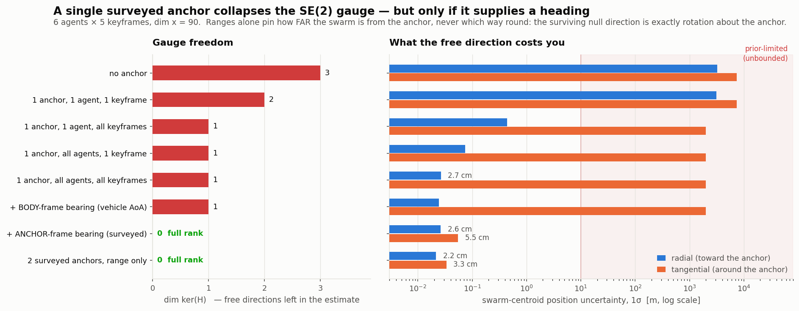
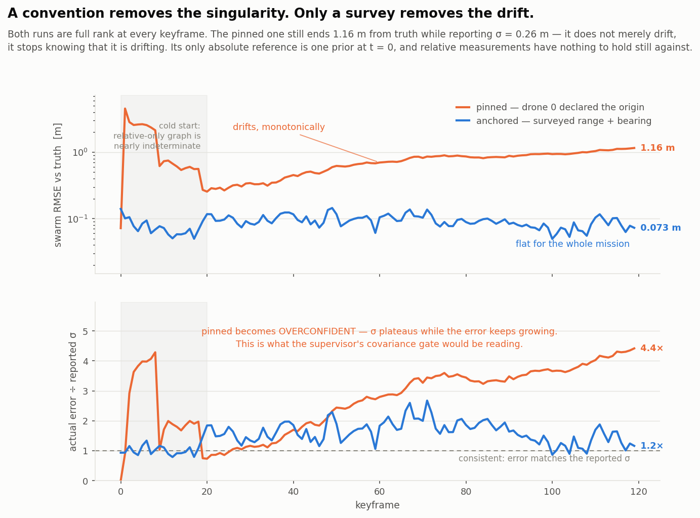
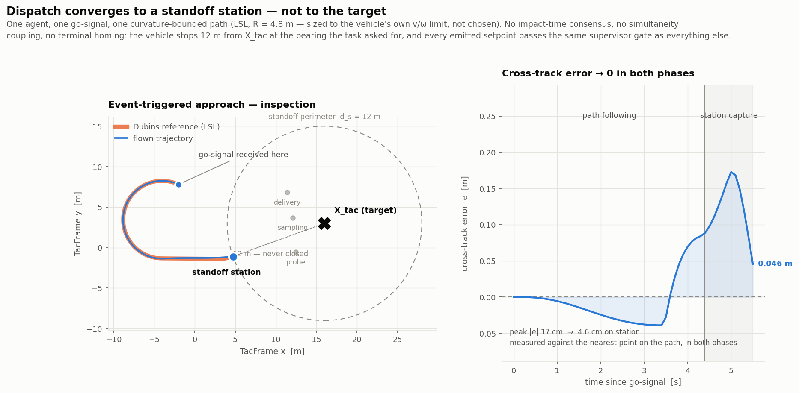
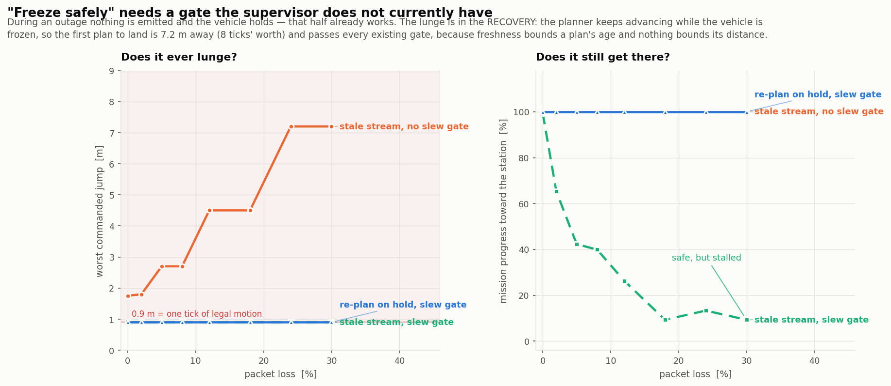

# hive_assist — anchor-referenced cooperative swarm

**From a coordinate in hand to gated setpoints.** An external detector says
*"the thing is at (lat, lon)"*. Everything from there on is this directory:
establish a metric frame off a surveyed anchor, hold an anchored loiter mesh,
elect a sub-team by auction, and dispatch one agent to a standoff station near
the target — with every emitted setpoint pre-validated against the same
invariants the Rust supervisor enforces.

Builds on [`../brain/`](../brain/) — the iSAM2 estimator, the `swarm-supervisor`
crate, the MAVLink path. Reuse first, extend second.

> Target *detection* is explicitly not our domain. Our input contract is one
> message `{lat, lon, alt?, task_id}`; our output contract is per-tick,
> per-vehicle `SET_POSITION_TARGET_LOCAL_NED`, already gated.

Plan and full derivations: [ANCHOR_SWARM_PLAN.md](ANCHOR_SWARM_PLAN.md).
Run instructions: [RUN.md](RUN.md). **218 tests, all passing.**

---

## The result in one figure each

### Domain 1 — a surveyed anchor makes the estimator full-rank



The plan claimed a single anchor collapses the SE(2) gauge from 3 to 0. Measured,
it does not — **not with ranges alone**. Rotate the whole solution about the
anchor and every anchor range, every inter-agent range and every body-frame
odometry residual is preserved. The symmetry is exact, so `dim ker(H) = 1`
survives however long the swarm flies.

| | |
|---|---|
| no anchor | `dim ker(H) = 3` |
| 1 anchor, range only | `1` — rotation about the anchor, alignment 1.000000000 |
| + bearing in the **vehicle's** frame | `1` — buys nothing |
| + bearing in the **anchor's surveyed** frame | **`0`** |
| 2 surveyed anchors, range only | **`0`** |

In metres: range-only pins the swarm centroid **radially to 2.7 cm** and leaves
it **tangentially free at 2006 m**. You know how far away you are, not which way
round. So the plan's open question has a definite answer — survey the anchor's
*heading*, or survey a *second* anchor. The motion-baseline route does not exist.

### Domain 1 — and it stays attached to the world



The contrast the plan is really about. A reference *drone* removes the
singularity (a convention); a surveyed *anchor* removes the drift (external
information). Both runs are full rank at every keyframe. The pinned one ends
**1.16 m from truth while reporting σ = 0.26 m** — it does not merely drift, it
stops knowing that it is drifting, and that reported σ is exactly what the
supervisor's covariance gate reads.

### Domain 2 — `M→N` handover with zero supervisor rejections

```
ANCHOR_INIT  -> LOITER_MESH   frame surveyed, mesh inside fence
LOITER_MESH  -> TASK_INGEST   target projected into TacFrame
TASK_INGEST  -> AUCTION       coalition [2, 3] elected in 3 rounds
AUCTION      -> RECONFIG      loiter re-solved over 10 agents
RECONFIG     -> DISPATCH      approach stream pre-validated

supervisor ACCEPT   80/80        guard failures    0
supervisor REJECT   0            min clearance     1.273 m (floor 1.2)
                                 max tick step     0.900 m (limit 0.9)
```

`ACCEPT` is the steady state by construction: each transition forward-simulates
its full setpoint stream over horizon `H` and only commits if the stream already
satisfies every invariant. A `REJECT` would be a caught bug, not an event.

### Domain 3 — dispatch converges to a station, never to the target



Edge-triggered on the go-signal, single agent, curvature-bounded Dubins path
sized from the vehicle's own `v/ω` limit. No impact-time consensus, no
simultaneity coupling, no terminal homing — the vehicle stops 12 m from `X_tac`
at the bearing the task asked for. Peak cross-track error 17 cm.

### Domain 4 — "freeze safely" needs a gate that does not exist yet



The half that already works: during an outage nothing is emitted and the vehicle
holds. **The lunge is in the recovery.** While the vehicle is frozen the planner
keeps advancing its stream, so the first plan to land is 7.2 m away — 8× a legal
tick — and it passes every gate the supervisor has, because *freshness bounds a
plan's age and nothing bounds its distance*.

Fixing it takes both halves. The gate alone is safe and stalls (9% mission
progress at 30% loss); re-planning alone still lunges. Together: 0.90 m worst
jump, 100% progress, at every loss level.

---

## Layout

```
hive/
  frames.py            D1.0  geodetic → TacFrame (the one geodesy boundary)
  anchor_factor.py     D1.1  residuals, analytic Jacobians, gauge generators
  nullspace.py         D1.2  the rank ladder
  anchored_isam2.py    D1.3  GTSAM/iSAM2, anchored vs pinned
  cbba.py              D2.1  coverage-aware bids, consensus election, graph cut
  supervisor_gate.py   D2.2  Python mirror of the Rust invariants + horizon guard
  mission_fsm.py       D2.3  the guarded FSM
  standoff.py          D3    stations, Dubins, vector-field follower + capture
  loss_model.py        D4.3  netem in Python; the safe-hold proof
  plots.py                   every figure
tests/                       one module per deliverable
sim/                         D4.1/D4.2 — runs on the Zephyrus (see sim/README.md)
figures/                     generated by `make figures`
```

## How this couples to the Brain

| Brain asset | how it is used |
|---|---|
| iSAM2 estimator idiom (`day8_isam2.py`) | `anchored_isam2.py` uses the same `CustomFactor` pattern |
| Rust `swarm-supervisor` | `supervisor_gate.py` mirrors it, and `test_gate_parity.py` diffs both on 120 randomised cases against the real binary |
| `PLAN_SCHEMA` | the FSM emits the same wire shape |
| MAVLink `close_the_loop.py` | where gated setpoints eventually go |

The Rust supervisor stays authoritative and **unmodified**. The Python mirror
exists because the FSM has to ask "would the supervisor take this?" thousands of
times while searching, which it cannot do by shelling out to a binary — and it is
tested against the original so a divergence is a test failure rather than a
silent belief in a gate that does not exist.

## Where the plan was wrong

Every bug found while building this, explained in plain language and grouped by
domain: **[docs/BUGS.md](docs/BUGS.md)**. Sixteen of them, of which only two were
ordinary broken code — the rest were wrong beliefs, lying measurements, or gaps
between two pieces that each assumed the other was handling it.

The findings that corrected the plan rather than confirming it are also tabulated
at the end of
[ANCHOR_SWARM_PLAN.md](ANCHOR_SWARM_PLAN.md#findings-that-changed-the-design).
The load-bearing ones:

- a single **range-only** anchor leaves one exact degree of freedom, forever;
- a bearing only counts in an **externally-known** frame;
- block-diagonalising the **control** graph does not block-diagonalise the
  **collision** constraint;
- `e → 0` and **"arrives"** are separate claims, and a vector field only gives
  you the first;
- the supervisor needs a **`SlewTooLarge`** gate.
